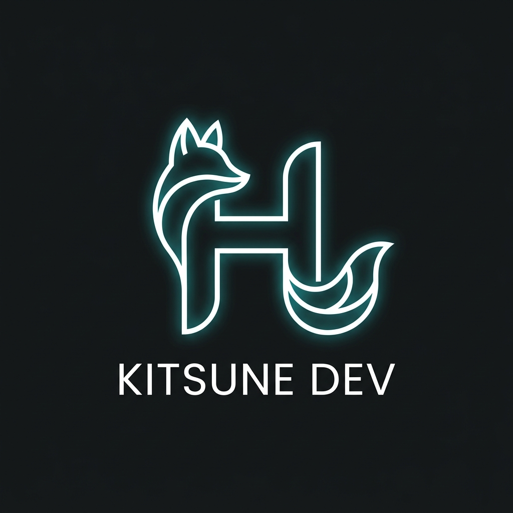

<div align="center">



# ✦ Hardik Bhaskar — Portfolio

**Full Stack Developer & AI Systems Builder**

[](https://hardikbhaskar.dev)
[](https://react.dev)
[](https://www.typescriptlang.org)
[](https://threejs.org/)
[](https://tailwindcss.com)
[](https://www.framer.com/motion)

*A cinematic, immersive personal portfolio built with React Three Fiber, glassmorphism, carbon aesthetics, and smooth parallax.*

---


</div>

---

## ✨ Features

- 🎬 **Cinematic Intro Screen** — Animated logo reveal with text scramble & loading bar
- 🔮 **3D Scroll Companion** — A highly performant R3F glowing spirit orb that tracks scroll and flies to hover over section headers.
- 🧊 **Interactive 3D Elements** — Floating WebGL geometries (Icosahedrons) integrated seamlessly into Bento grids using `react-three-fiber`.
- 🧭 **Converging Floating Navbar** — Full-width bar that morphs into a compact glass pill on scroll
- 🪟 **Glassmorphism UI** — 4 glass variants (base, medium, strong, cyan/violet tinted) with frosted backdrop blur
- 🖤 **Carbonic Aesthetic** — Carbon fiber woven texture throughout, deep `#05050A` base
- ✨ **Iridescent Borders** — Cyan → Violet → Rose gradient borders on hover
- 🌊 **Lenis Smooth Scroll** — Physics-based eased scrolling with parallax depth
- 🎭 **Framer Motion** — Page transitions, scroll-triggered reveals, masonry stagger animations
- 🖱️ **Custom Glass Cursor** — Frosted-glass ring cursor with magnetic expansion on hover
- 📊 **Scroll Progress Bar** — Spring-animated cyan → violet gradient at top of viewport
- 🎨 **Iconsax & Typography** — Premium two-tone bulk icons (`iconsax-react`) paired with 5 Google Fonts (Instrument Serif, Syne, Space Grotesk, Inter, JetBrains Mono)
- 📱 **Fully Responsive** — Mobile-first adaptive grids and viewport-aware 3D scaling
- ⚡ **Vite 5** — Lightning-fast HMR & optimized production builds

---

## 🛠 Tech Stack

| Layer | Technology |
|---|---|
| **Framework** | React 18 + TypeScript |
| **Build Tool** | Vite 5 |
| **Styling** | Tailwind CSS v3 + Vanilla CSS |
| **Animation** | Framer Motion 11 |
| **3D Engine** | Three.js + React Three Fiber (`@react-three/fiber`, `@react-three/drei`) |
| **Smooth Scroll** | Lenis (studio-freight) |
| **Routing** | React Router v6 |
| **Icons** | Iconsax React + Lucide React |
| **State Management** | Zustand (for global scroll-tracking coordinates) |
| **Scroll Triggers** | react-intersection-observer |

---

## 🚀 Getting Started

### Prerequisites

- Node.js `≥ 18`
- npm `≥ 9`

### Installation

```bash
# Clone the repository
git clone https://github.com/HardikBhaskar2010/Portfolio.git
cd Portfolio/portfolio

# Install dependencies
npm install

# Start dev server
npm run dev
```

Open **http://localhost:5173** in your browser.

### Build for Production

```bash
npm run build
npm run preview
```

---

## 📁 Project Structure

```
portfolio/
├── public/
│   └── images/
│       ├── logo.png          # Brand logo
│       ├── avatar.png        # Profile photo
│       └── projects/         # Project screenshots
│
├── src/
│   ├── components/
│   │   ├── three/
│   │   │   ├── FloatingGeoms.tsx # R3F canvas for floating geometries
│   │   │   ├── ScrollOrb.tsx     # 3D orb scroll companion
│   │   │   └── WebGLGuard.tsx    # Fallback for devices without WebGL
│   │   │
│   │   ├── layout/
│   │   │   ├── Navbar.tsx        # Converging floating navbar
│   │   │   └── Footer.tsx
│   │   ├── sections/
│   │   │   ├── Hero.tsx          # 2-col hero with parallax blobs
│   │   │   ├── FeaturedWork.tsx  # 3D tilt project cards
│   │   │   ├── AboutPreview.tsx  # Bento grid about section
│   │   │   ├── MarqueeBanner.tsx # Infinite scroll marquee
│   │   │   ├── Testimonials.tsx
│   │   │   ├── FAQ.tsx
│   │   │   └── ContactSection.tsx
│   │   └── ui/
│   │       ├── Button.tsx
│   │       ├── IntroScreen.tsx   # Cinematic loading screen
│   │       ├── ScrollProgressBar.tsx
│   │       ├── SectionLabel.tsx
│   │       ├── HighlightPoint.tsx# Registers DOM coordinates for ScrollOrb
│   │       ├── ToolIcon.tsx      # Iconsax mapping system
│   │       └── Tag.tsx
│   │
│   ├── pages/
│   │   ├── Home.tsx
│   │   ├── Projects.tsx
│   │   ├── ProjectDetail.tsx
│   │   ├── About.tsx
│   │   └── NotFound.tsx
│   │
│   ├── data/
│   │   ├── projects.ts       # Project data
│   │   └── tools.ts          # Skills, experience, services
│   │
│   ├── store/
│   │   └── highlightStore.ts # Zustand state tracking DOM coordinates for 3D orb
│   │
│   ├── lib/
│   │   ├── lenis.ts          # Smooth scroll singleton + hooks
│   │   └── motion.ts         # Framer Motion variant library
│   │
│   ├── App.tsx               # Root — Navbar/Cursor outside AnimatePresence
│   ├── index.css             # Design system (glass, carbon, glow)
│   └── main.tsx
│
├── tailwind.config.cjs       # Carbonic color palette + tokens
├── postcss.config.cjs        # PostCSS (CJS for ESM compatibility)
└── vite.config.ts
```

---

## 🎨 Design System

### Color Palette — Carbonic

| Token | Value | Usage |
|---|---|---|
| `bg` | `#05050A` | Page background |
| `carbon` | `#07070D` | Carbon panel base |
| `surface` | `#111118` | Card backgrounds |
| `border` | `#1E1E2E` | Dividers & outlines |
| `cyan` | `#00E5FF` | Primary accent |
| `violet` | `#7C3AED` | Secondary accent |
| `rose` | `#FB7185` | Tertiary accent |
| `heading` | `#F0F0F8` | Primary text |

### Glass Variants

```css
.glass        /* backdrop-blur(24px), 2.8% white bg, subtle border */
.glass-md     /* backdrop-blur(32px), 4.2% white bg */
.glass-strong /* backdrop-blur(48px), 5.5% white bg */
.glass-cyan   /* cyan-tinted with cyan border glow */
.glass-violet /* violet-tinted with violet border glow */
.glass-dark   /* navbar-style, 72% dark bg */
```

### Iridescent Border

```tsx
<div className="iridescent-border rounded-2xl">
  {/* Cyan → Violet → Rose gradient border appears on hover */}
</div>
```

---

## 📝 Key Architecture Decisions

### Navbar Outside AnimatePresence
The `<Navbar />` is rendered at the **App root level**, completely outside `AnimatePresence`. This is critical — Framer Motion's page transition `transform`/`opacity` animations create new stacking contexts that break `position: fixed` for all child elements. By hoisting the Navbar to the root, it is truly viewport-fixed on all routes.

### Lenis Scroll Events
The Navbar reads scroll position via `lenis.on('scroll')` rather than `window.scroll`. Lenis with `smoothWheel: true` uses a virtual scroll position — `window.scrollY` lags behind the eased position, causing incorrect compact-state detection. The Lenis event fires on every animation frame with the exact virtual scroll value.

### ESM + CJS Config Resolution
Since `package.json` sets `"type": "module"`, all `.js` config files are treated as ESM by Node. PostCSS and Tailwind configs use `module.exports` (CJS syntax), so they are named `.cjs` (`tailwind.config.cjs`, `postcss.config.cjs`) to force CommonJS interpretation.

---

## 🔮 Sections

| Section | Description |
|---|---|
| **Hero** | 2-column layout — display type left, avatar card + project previews right |
| **Marquee** | Infinite scroll tech/skill banner |
| **Featured Work** | 3D tilt project cards with iridescent hover borders |
| **About Preview** | Bento grid with stats, skills, availability badge |
| **Testimonials** | Client quotes with avatar cards |
| **FAQ** | Accordion with smooth height animation |
| **Contact** | Glass form card with social links |

---

## 📬 Contact

**Hardik Bhaskar** *(Luna Kitsune)*

[](mailto:hardik.bhaskar2010@gmail.com)
[](https://github.com/HardikBhaskar2010)
[](https://www.linkedin.com/in/luna-kitsune-8a107a3bb/)
[](https://x.com/kitsune_luna05)

---

<div align="center">

Built with 🤍 by **Hardik Bhaskar**

*"Designing intelligent digital experiences."*

</div>
